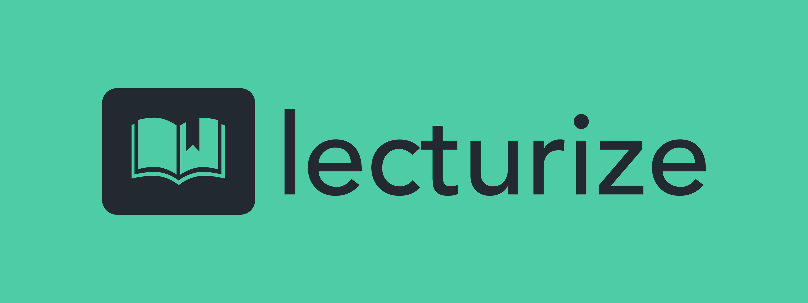

<a id="readme-top"></a>
<!--
  _____________________
< Welcome to lecturize! >
  ---------------------
         \   ^__^ 
          \  (oo)\_______
             (__)\       )\/\\
                 ||----w |
                 ||     ||
-->


<!-- PROJECT SHIELDS -->
[![Contributors][contributors-shield]][contributors-url]
[![Forks][forks-shield]][forks-url]
[![Stargazers][stars-shield]][stars-url]
[![Issues][issues-shield]][issues-url]
[![MIT License][license-shield]][license-url]


<!-- PROJECT LOGO -->
<br />
<div align="center">
  <a href="https://github.com/ski3r3n/lecturizefinal">
    
  </a>

<h2 align="center">Lecturize</h3>

  <p align="center">
    An awesome way to revise class contents
    <br />
    <a href="https://lecturizepw.netlify.app"><strong>Explore Lecturize »</strong></a>
    <br />
    <br />
    <a href="https://lecturizepw.netlify.app">View Live</a>
    ·
    <a href="https://github.com/ski3r3n/lecturizefinal/issues/new?labels=bug&template=bug-report---.md">Report Bug</a>
    ·
    <a href="https://github.com/ski3r3n/lecturizefinalissues/new?labels=enhancement&template=feature-request---.md">Request Feature</a>
  </p>
</div>


<!-- TABLE OF CONTENTS -->
<details>
  <summary>Table of Contents</summary>
  <ol>
    <li>
      <a href="#about-the-project">About The Project</a>
      <ul>
        <li><a href="#built-with">Built With</a></li>
      </ul>
    </li>
    <li>
      <a href="#getting-started">Getting Started</a>
      <ul>
        <li><a href="#prerequisites">Prerequisites</a></li>
        <li><a href="#installation">Installation</a></li>
      </ul>
    </li>
    <li><a href="#usage">Usage</a></li>
    <li><a href="#roadmap">Roadmap</a></li>
    <li><a href="#contributing">Contributing</a></li>
    <li><a href="#license">License</a></li>
    <li><a href="#contact">Contact</a></li>
    <li><a href="#acknowledgments">Acknowledgments</a></li>
  </ol>
</details>


<!-- ABOUT THE PROJECT -->
## About The Project

[![Product Name Screen Shot][product-screenshot]](https://lecturizepw.netlify.app)

Lecturize is a platform that converts verbal teaching into concise, summarized revision notes using AI.

<p align="right">(<a href="#readme-top">back to top</a>)</p>


### Built With

* [![Next][Next.js]][Next-url]
* [![PostgreSQL][PostgreSQL.org]][PostgreSQL-url]
* [![Prsima][Prisma.io]][Prisma-url]

<p align="right">(<a href="#readme-top">back to top</a>)</p>


## Getting Started

You are strongly recommended to use the deployed version of Lecturize at [https://lecturizepw.netlify.app](https://lecturizepw.netlfiy.app). An alternative is [https://lecturize.vercel.app](https://lecturize.vercel.app)

However, if you wish to run it locally, you can follow the steps below.

### Prerequisites

To run Lecturize locally, you will need these software installed:
* NodeJS
* A package manager (e.g., `npm`, `yarn`, `pnpm`)

### Installation

1. Clone the repository:
    ```bash
    git clone https://github.com/ski3r3n/lecturizefinal.git
    ```
2. Navigate to the project directory:
    ```bash
    cd lecturizefinal
    ```
3. Install the dependencies:
    ```bash
    yarn install
    ```

<p align="right">(<a href="#readme-top">back to top</a>)</p>


<!-- USAGE EXAMPLES -->
## Usage

### Using Lecturize (Website)

Visit [https://lecturize.vercel.app/](https://lecturize.vercel.app/) to use the platform online.

### Running the Program Locally

1. Start the local development server:
```bash
yarn dev
```
2. Open [http://localhost:3000](http://localhost:3000) in your browser to access the platform.

<p align="right">(<a href="#readme-top">back to top</a>)</p>


<!-- ROADMAP -->
## Developing

See the [open issues](https://github.com/github_username/repo_name/issues) for a full list of proposed features (and known issues).

<p align="right">(<a href="#readme-top">back to top</a>)</p>


<!-- CONTRIBUTING -->
## Contributing

Contributions are what make the open source community such an amazing place\. Any contributions you make are **greatly appreciated**.

If you have a suggestion that would make this better, please fork the repo and create a pull request. You can also simply open an issue with the tag "enhancement".

1. Fork the Project
2. Create your Feature Branch (`git checkout -b feature/AmazingFeature`)
3. Commit your Changes (`git commit -m 'Add some AmazingFeature'`)
4. Push to the Branch (`git push origin feature/AmazingFeature`)
5. Open a Pull Request

<p align="right">(<a href="#readme-top">back to top</a>)</p>


<!-- LICENSE -->
## License

This project is licensed under the MIT license. See the [LICENSE](LICENSE) file for details.
<p align="right">(<a href="#readme-top">back to top</a>)</p>


<!-- MARKDOWN LINKS & IMAGES -->
<!-- https://www.markdownguide.org/basic-syntax/#reference-style-links -->
[contributors-shield]: https://img.shields.io/github/contributors/ski3r3n/lecturizefinal.svg?style=for-the-badge
[contributors-url]: https://github.com/ski3r3n/lecturizefinal/graphs/contributors
[forks-shield]: https://img.shields.io/github/forks/ski3r3n/lecturizefinal.svg?style=for-the-badge
[forks-url]: https://github.com/ski3r3n/lecturizefinal/network/members
[stars-shield]: https://img.shields.io/github/stars/ski3r3n/lecturizefinal.svg?style=for-the-badge
[stars-url]: https://github.com/ski3r3n/lecturizefinal/stargazers
[issues-shield]: https://img.shields.io/github/issues/ski3r3n/lecturizefinal.svg?style=for-the-badge
[issues-url]: https://github.com/ski3r3n/lecturizefinal/issues
[license-shield]: https://img.shields.io/github/license/ski3r3n/lecturizefinal.svg?style=for-the-badge
[license-url]: https://github.com/ski3r3n/lecturizefinal/blob/master/LICENSE.txt
[product-screenshot]: https://i.ibb.co/YfCtkVH/workflow-diagram.png
[Next.js]: https://img.shields.io/badge/next.js-000000?style=for-the-badge&logo=nextdotjs&logoColor=white
[Next-url]: https://nextjs.org/
[React.js]: https://img.shields.io/badge/React-20232A?style=for-the-badge&logo=react&logoColor=61DAFB
[React-url]: https://reactjs.org/
[Vue.js]: https://img.shields.io/badge/Vue.js-35495E?style=for-the-badge&logo=vuedotjs&logoColor=4FC08D
[Vue-url]: https://vuejs.org/
[Angular.io]: https://img.shields.io/badge/Angular-DD0031?style=for-the-badge&logo=angular&logoColor=white
[Angular-url]: https://angular.io/
[Svelte.dev]: https://img.shields.io/badge/Svelte-4A4A55?style=for-the-badge&logo=svelte&logoColor=FF3E00
[Svelte-url]: https://svelte.dev/
[Laravel.com]: https://img.shields.io/badge/Laravel-FF2D20?style=for-the-badge&logo=laravel&logoColor=white
[Laravel-url]: https://laravel.com
[Bootstrap.com]: https://img.shields.io/badge/Bootstrap-563D7C?style=for-the-badge&logo=bootstrap&logoColor=white
[Bootstrap-url]: https://getbootstrap.com
[Prisma.io]: https://img.shields.io/badge/Prisma-3982CE?style=for-the-badge&logo=Prisma&logoColor=white
[Prisma-url]: https://prisma.io
[Postgresql.org]: https://img.shields.io/badge/PostgreSQL-316192?style=for-the-badge&logo=postgresql&logoColor=white
[Postgresql-url]: https://www.postgresql.org
[JQuery.com]: https://img.shields.io/badge/jQuery-0769AD?style=for-the-badge&logo=jquery&logoColor=white
[JQuery-url]: https://jquery.com 
